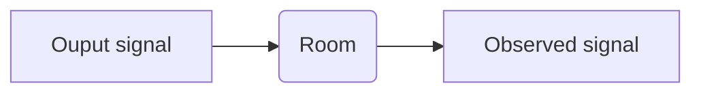
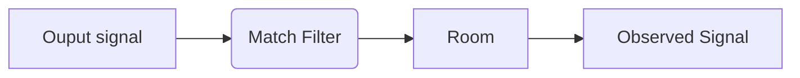

# Noise reduction with Match Filter

## Introduction
Noise cancelation headphones and speakers have been very popular throughout these years that had became a must for high quality products. There are various ways for noise cancelation and they are also suitable in different senarioes. When a device or speaker is placed in a position in the room, it is impossible to costimize every speaker for each types of rooms. Therefore, we have to find a solution that has noise cancelation function that fits for all typical scenarioes. In this project, we want to find the transfer function of the room and then apply the transfer function so that when people hear the audio, it is already noise canceled. This main project is coded in C.  

## How this project works
If we attach a microphone onto the speaker, we can now gather the output of the signal the room. Then now we assume that we know the orignal audio signal and the observed audio signal.
The is the concept and basic idea of how this project works. The math behind this project is quite straight forward. Need some basic understanding of signal processing, fourier transform(z transform), and basic C coding ability. It is clear that our goal is to find the transfer function of the room.

So when we write it in math, we could represent the diagram above as, where h[n] is the transfer function of the room, x[n] is the output signal, and x'[n] is the signal what human ear observe.
$$ x'[n] = x[n] * h[n] $$
When we convolve on the time domain, we multiply on the frequency domain. 
$$ X'(f) = X(f) H(f) $$
In other words, we now know 
$$ H(f) = {X'(f) \over X(f)} $$

so then if we know apply a new filter between human ear block and the room block, then we can change the audio that human observe.

Now let the transfer function of the new filter be h'[n]
$$ H'(f) = {1 \over H(f)} $$

Then we can guarantee the observed audio
$$ X'(f) = X(f) H'(f) H(f) = X(f){1 \over H(f)}H(f) = X(f)$$

So now it is obvious that we have to find the inverse of the transfer function of the room and apply it before sending the signal.

Take echo as an example, where the observed signal  x'[n] is the orginal signal + the kth delay signal with a specific gain.
$$x'[n] = 0.5x[n] + 0.2x[n-k]$$
then the [Z Transform](https://en.wikipedia.org/wiki/Z-transform#:~:text=In%20mathematics%20and%20signal%20processing,transform%20(s%2Ddomain).) of the observed signal would be
$$ X'(z) = H(z)X(z)$$
where
$$X'(z) = 0.5X(z)+0.2z^{-k}X(z)$$
therefore, we can get the value of H(z), which is the transfer function of the room
$$ H(z) = 0.5 + 0.2 z^{-k} $$
Then the match filter H'(z) would be 
$$ H'(z) = {1 \over H(f)} = {1\over 0.5 + 0.2 z^{-k}}$$
Now we can calculate the inverse Z Transform of H'(z), where u[n] is the [unit-step function](https://www.intmath.com/laplace-transformation/1a-unit-step-functions-definition.php)
$$h'[n] = 10(-0.4)^n u[n]$$

Now if we know the function of the match filter, we could convolve it with the signal and take it as the output signal

::: warning
Note that there will be FIR and IIR filter issues in this case. Since IIR filter has recurrsive structures which is much harder to implement in real world. But I don't know what will cause this issue. I need Vincent's help! T_T
:::

## Results

## Reference
