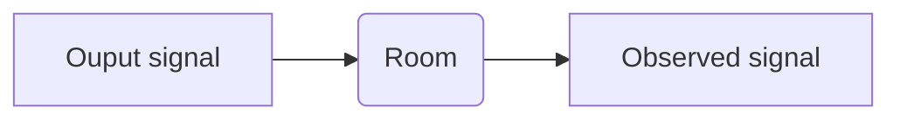
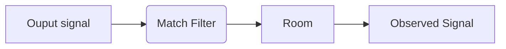

# Noise reduction with Match Filter

## Introduction
Noise cancelation headphones and speakers have been very popular throughout these years that had became a must for high quality products. There are various ways for noise cancelation and they are also suitable in different senarioes. When a device or speaker is placed in a position in the room, it is impossible to costimize every speaker for each types of rooms. Therefore, we have to find a solution that has noise cancelation function that fits for all typical scenarioes. In this project, we want to find the transfer function of the room and then apply the transfer function so that when people hear the audio, it is already noise canceled. This main project is coded in C.  


## Background 
#### How the math works
If we attach a microphone onto the speaker, we can now gather the output of the signal the room. Then now we assume that we know the orignal audio signal and the observed audio signal.
The is the concept and basic idea of how this project works. The math behind this project is quite straight forward. Need some basic understanding of signal processing, fourier transform(z transform), and basic C coding ability. It is clear that our goal is to find the transfer function of the room.



So when we write it in math, we could represent the diagram above as, where h[n] is the transfer function of the room, x[n] is the output signal, and x'[n] is the signal what human ear observe.
$$ x'[n] = x[n] * h[n] $$
When we convolve on the time domain, we multiply on the frequency domain. 
$$X'(f) = X(f) H(f)$$
In other words, we now know 
$$H(f) = {X'(f) \over X(f)}$$


so then if we know apply a new filter between human ear block and the room block, then we can change the audio that human observe.



Now let the transfer function of the new filter be h'[n]
$$H'(f) = {1 \over H(f)}$$

Then we can guarantee the observed audio
$$X'(f) = X(f) H'(f) H(f) = X(f){1 \over H(f)}H(f) = X(f)$$

So now it is obvious that we have to find the inverse of the transfer function of the room and apply it before sending the signal.

Take echo as an example, where the observed signal  x'[n] is the orginal signal + the kth delay signal with a specific gain.
$$x'[n] = 0.5x[n] + 0.2x[n-k]$$
then the [Z Transform](https://en.wikipedia.org/wiki/Z-transform#:~:text=In%20mathematics%20and%20signal%20processing,transform%20(s%2Ddomain).) of the observed signal would be
$$X'(z) = H(z)X(z)$$
where
$$X'(z) = 0.5X(z)+0.2z^{-k}X(z)$$
therefore, we can get the value of H(z), which is the transfer function of the room
$$H(z) = 0.5 + 0.2 z^{-k}$$
Then the match filter H'(z) would be 
$$H'(z) = {1 \over H(f)} = {1\over 0.5 + 0.2 z^{-k}}$$
Now we can calculate the inverse Z Transform of H'(z), where u[n] is the [unit-step function](https://www.intmath.com/laplace-transformation/1a-unit-step-functions-definition.php)
$$h'[n] = 10(-0.4)^n u[n]$$

Now if we know the function of the match filter, we could convolve it with the signal and take it as the output signal


::: warning
Note that there will be FIR and IIR filter issues in this case. Since IIR filter has recurrsive structures which is much harder to implement in real world.
:::

#### Implementation in Python
This is a very quick walk through with python code to make sure this concept is working. Since runtime of python is long, we want to minmize the runtime to prevent notivable delay which is why we want to code in C. 

``` python 3.7.0
## load audio file into notebook
file_location = 'audio/ori_audio.wav'  ## output audio file
original_audio, sr = librosa.load(file_location)
file_location = 'audio/echo_audio.wav' ## audio captured from the device
feedback_audio, sr = librosa.load(file_location)
```
Define **zeropadding function**, **framing_audio function** and **flatten_audio**, we need to window the data into small dataframes because the transfer function might not always be the same.
``` python 3.7.0
## make sure we can frame the inserted audio prefectly
def zeropadding(audio, samples_per_frame):
    remain = audio.shape[0] % samples_per_frame
    remain = int(remain)
    add = samples_per_frame - remain
    add = int(add)
    new_audio = np.zeros(audio.shape[0] + add)
    for i in range(audio.shape[0]):
        new_audio[i] = audio[i]
    return new_audio
  
## reshape the audio into a 2D array   
def framing_audio(audio, sr, time):  ## time in seconds
    samples_per_frame = sr / (1/time)
    samples_per_frame = int(samples_per_frame)
    audio_len = audio.shape[0]
    if(audio_len % samples_per_frame != 0 ):
        audio = zeropadding(audio, samples_per_frame)
        
    frame_num = audio.shape[0] / samples_per_frame
    frame_num = int(frame_num)
    
    data = []
    for i in range(frame_num-1):
        frame_data = audio[i*samples_per_frame:(i*samples_per_frame) + samples_per_frame-1]
        data.append(frame_data)
        
    data = np.array(data)
    return data
    
## reshape the 2D framed audio to 1D signal 
def flatten_audio(framed_audio, frames):
    data = []
    data = np.array(data)
    for i in range(frames):
        data = np.append(data, framed_audio[i])
    return data
```

Then we now frame the given audio and then take it's fourier transform
``` python 3.7.0
time_sec = 0.2  ## duration of each frame in seconds
## window the audio file
ori_frame_data = framing_audio(original_audio, sr, time_sec)
feedback_frame_data = framing_audio(feedback_audio, sr, time_sec)

##then take the fourier transform of each data frame
from scipy.fft import fft, ifft
frames = ori_frame_data.shape[0]
smp_per_frame = ori_frame_data.shape[1]

fft_ori_data = []
fft_feedback_data = []

for i in range(frames):
    fft_ori_data.append(fft(ori_frame_data[i]))
    fft_feedback_data.append(fft(feedback_frame_data[i]))
    
fft_ori_data = np.array(fft_ori_data)
fft_feedback_data = np.array(fft_feedback_data)
```

From the math section, we know how to find the transfer function of the room and the match filter

``` python 3.7.0
## find the transfer function of the room
## H(f) = X'(f)/X(f)
## H'(f) = X(f)/X'(f)

room_transfer_function = []
filter_transfer_function = []

for i in range(frames):
    temp1 = []
    temp2 = []
    for j in range(smp_per_frame):
        target = fft_feedback_data[i][j] / fft_ori_data[i][j]
        temp1.append(target)
        temp2.append(1/target)
            
    temp1 = np.array(temp1)
    room_transfer_function.append(temp1)
    
    temp2 = np.array(temp2)
    filter_transfer_function.append(temp2)

room_transfer_function = np.array(room_transfer_function)
filter_transfer_function = np.array(filter_transfer_function)
```
Now we take fourier transform of the original audio and multipy it with the match filter transfer function. Then we multipy it again with the room's transfer function then we have the observed audio with noise cancelation.

``` python 3.7.0
observe_data = []
for i in range(frames):
    data_frame = ori_frame_data[i]
    ## take the fourier transform of the original audio
    fft_data = fft(data_frame)
    ## multipy it with the match filter function to get the new output audio
    new_output_fft = fft_data * filter_transfer_function[i]
    ## multipy with the room function to get the observed audio
    new_observe_fft = new_output_fft * room_transfer_function[i]
    ## take the inverse function of observed signal 
    temp = ifft(new_observe_fft)
    observe_data.append(temp)

## this is a complex value, now we discard the phase 
observe_data = abs(flatten_audio(observe_data, frames))

## disable this line so that you can listen to the echo canceled audio
## IPython.display.Audio(data=observe_data, rate=sr)

```
If we listen to the audio file we generate, it is obvious that the echo was prefectly canceled. However, there is also a severe distortion in the audio since we discarded the phase. There is definintely methods that we could overcome this problem. But we also proved that this method could somehow work.

## Results


## Reference
